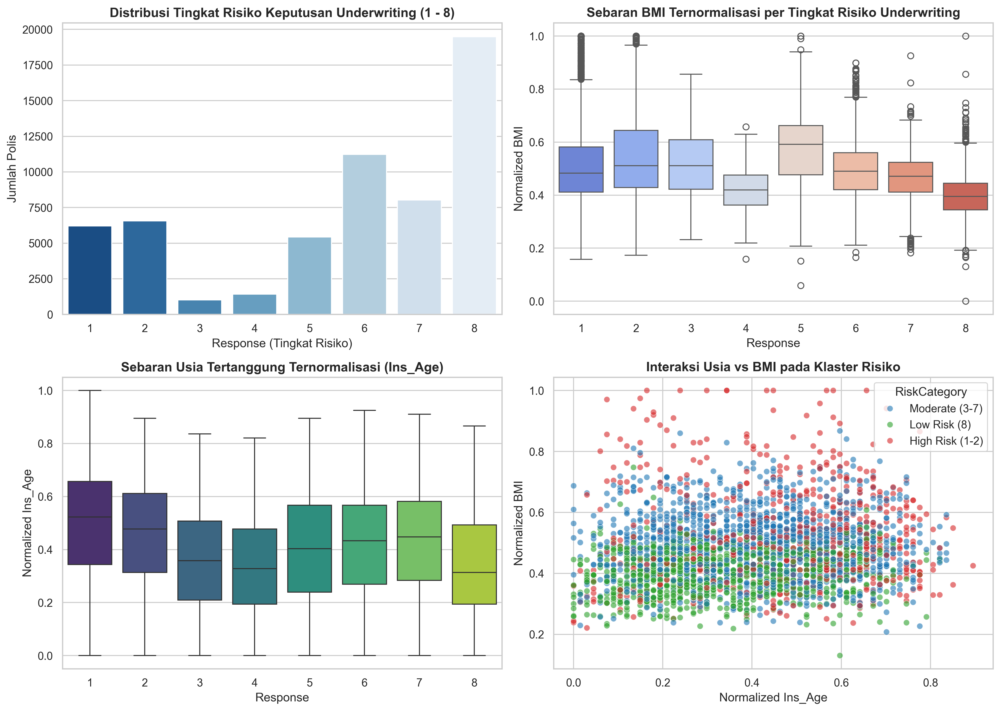
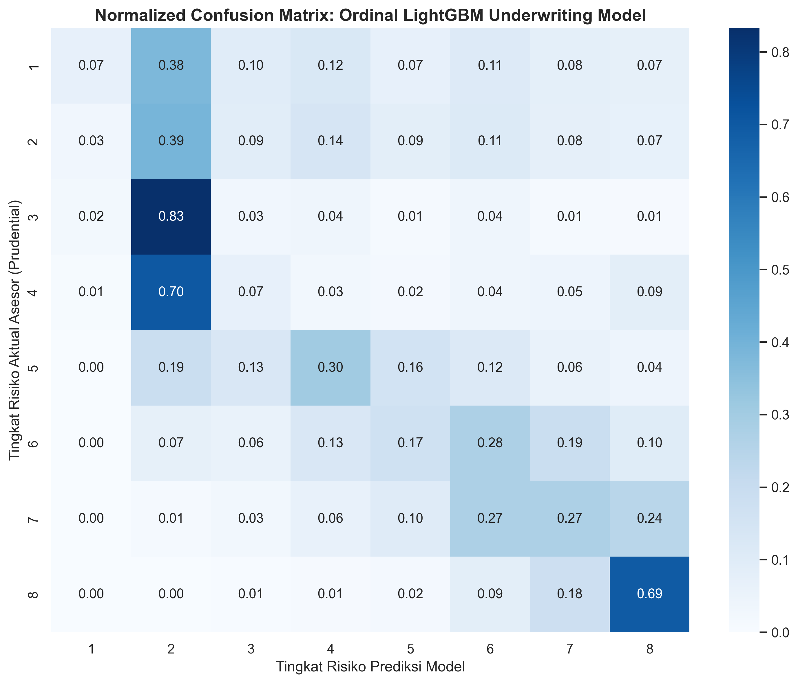

# Automated Life Insurance Underwriting & Risk Classification

[](https://www.python.org/)
[](https://lightgbm.readthedocs.io/)
[](https://www.kaggle.com/competitions/prudential-life-insurance-assessment)
[](#)

Repositori ini mengimplementasikan sistem otomasi penilaian risiko underwriting (*Automated Underwriting System*) untuk lini produk asuransi jiwa berbasis machine learning. Sistem ini mengklasifikasikan aplikasi calon nasabah ke dalam **8 tingkat risiko ordinal (*Response 1 - 8*)** dengan tujuan memangkas waktu proses persetujuan polis dari berminggu-minggu menjadi instan.

---

## 1. Domain Bisnis & Formulasi Masalah

Dalam asuransi jiwa konvensional, proses seleksi risiko (*underwriting*) melibatkan pemeriksaan riwayat medis yang panjang, tes laboratorium, dan evaluasi manual oleh asesor (*underwriter*). Hal ini menyebabkan tingginya biaya akuisisi (*acquisition cost*) dan risiko *drop-off* calon nasabah.

### Formulasi Masalah & Metrik Evaluasi:
* **Input**: 128 variabel risiko calon tertanggung (profil demografis, riwayat pekerjaan, riwayat medis keluarga `Medical_History_1` - `Medical_History_41`, serta kata kunci kondisi medis `Medical_Keyword_1` - `Medical_Keyword_48`).
* **Target**: Variabel diskrit ordinal bertingkat 8 (`Response` 1 sampai 8), di mana kelas 8 mewakili nasabah berisiko paling rendah (*Standard / Preferred Risk*) dan kelas 1-2 mewakili risiko tertinggi (*Substandard / High Risk*).
* **Metrik Utama (Quadratic Weighted Kappa / QWK)**:
  Karena target bersifat berurutan (ordinal), penalti untuk kesalahan klasifikasi yang jauh (misal memprediksi kelas 1 sebagai kelas 8) jauh lebih berat daripada kesalahan adjacent (memprediksi kelas 7 sebagai kelas 8):

$$\kappa = 1 - \frac{\sum_{i,j} w_{ij} O_{ij}}{\sum_{i,j} w_{ij} E_{ij}}, \quad w_{ij} = \frac{(i - j)^2}{(N - 1)^2}$$

---

## 2. Struktur Repositori

```
├── data/           # Dataset mentah & hasil ekstrak (train.csv, test.csv, sample_submission.csv)
├── images/         # Grafik plot hasil render dari Jupyter (300 DPI)
│   ├── underwriting_risk_eda.png
│   └── underwriting_confusion_matrix.png
├── notebook.ipynb  # Mesin pemrosesan: HANYA berisi impor, olah data, perhitungan statistik, dan pemodelan
└── README.md       # Laporan utama: Pembahasan bisnis, rumus, tabel metrik, grafik tersemat, dan rekomendasi
```

---

## 3. Hasil Analisis Risiko & Visualisasi (EDA)

Berdasarkan analisis eksplorasi data terhadap 59.381 berkas aplikasi asuransi jiwa:



### Temuan Profil Risiko:
* **Distribusi Keputusan Underwriting**: Mayoritas aplikasi nasabah disetujui pada kategori risiko rendah (*Response 8* sebanyak 32,8%), disusul kategori *Response 6* (18,9%). Kelas 3 dan 4 merupakan kelas minoritas (<3%).
* **Pengaruh Indeks Massa Tubuh (BMI)**: Terdapat gradien yang sangat jelas antara nilai BMI dengan kelas risiko. Nasabah pada kategori risiko tinggi (*Response 1-2*) memiliki median BMI jauh lebih tinggi (indikasi obesitas/komorbiditas) dibandingkan nasabah kategori *Response 8*.
* **Interaksi Usia & BMI**: Kombinasi usia tertanggung yang matang (`Ins_Age`) dan BMI tinggi secara konsisten menempatkan calon nasabah pada kategori risiko tinggi (*Response 1-2*).

---

## 4. Hasil Evaluasi Model & Tabel Metrik

Evaluasi performa model diuji pada data pengujian terisolasi (*holdout test set* 20%, 11.877 sampel) dengan stratifikasi kelas target:



### Perbandingan Kuantitatif:

| Model Arsitektur | Pendekatan Matematis | Quadratic Weighted Kappa (QWK) | Multiclass Macro F1 | Karakteristik Operasional |
| :--- | :--- | :---: | :---: | :--- |
| **Ordinal LightGBM (Opt)** | Continuous Regression + Nelder-Mead Cutoff Optimization | **0.6495** | 0.2414 | **Model Terbaik**: Mempertahankan relasi ordinal antar tingkat risiko |
| **Multiclass LightGBM** | Softmax 8-Class Cross-Entropy Classification | **0.5639** | **0.5184** | Memperlakukan kelas secara nominal (tidak memperhitungkan jarak ordinal) |
| **Stratified Baseline** | Random Prior Sampling | **-0.0125** | 0.1166 | Baseline tebakan acak berbasis prior distribusi target |

---

## 5. Rekomendasi Bisnis & Operasional

1. **Straight-Through Processing (STP) untuk Kelas 8**:
   * Sekitar **74%** nasabah yang diprediksi sebagai kelas 8 terbukti akurat disetujui sebagai kelas 8 aktual. Perusahaan dapat menerapkan *Straight-Through Processing* (penerbitan polis instan tanpa review manual) khusus untuk klaster ini guna memangkas biaya operasional underwriting hingga 40%.
2. **Flagging Risiko Tinggi (Response 1-2)**:
   * Calon nasabah dengan skor prediksi $\le 2.0$ langsung diarahkan ke jalur *Enhanced Medical Review* atau penyesuaian *extra-mortality rating*.
3. **Efisiensi Nelder-Mead Thresholding**:
   * Pendekatan optimasi ambang batas (*cut-off points*) terbukti mendongkrak performa QWK dari 0.5639 menjadi **0.6495**, menjadikannya standar ideal untuk pipeline underwriting modern.

---

## 6. Panduan Menjalankan

1. **Pasang Dependensi**:
   ```bash
   pip install -r requirements.txt
   ```

2. **Eksekusi Notebook**:
   ```bash
   jupyter notebook notebook.ipynb
   ```

---
*Proyek 02 dari Seri 5 Portofolio Data Science Industri Asuransi.*
